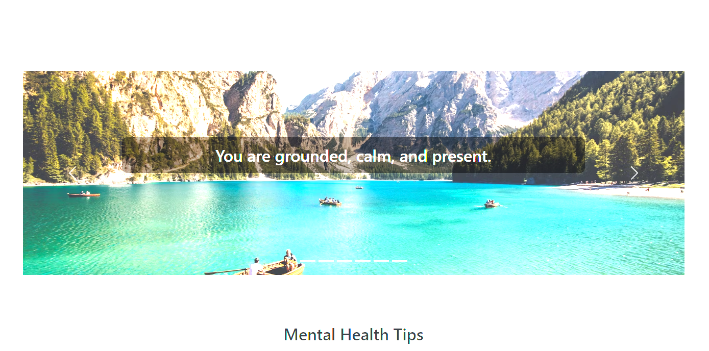
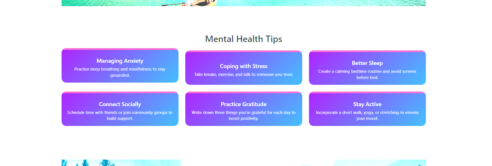
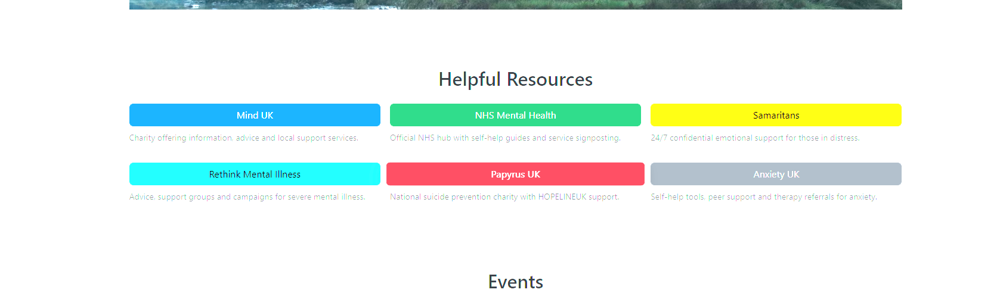
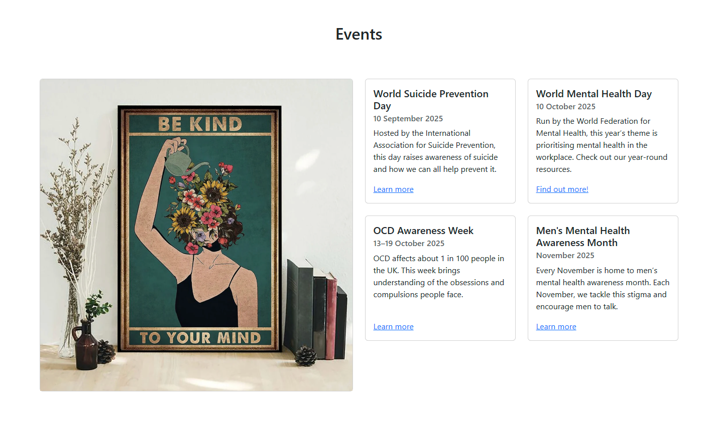
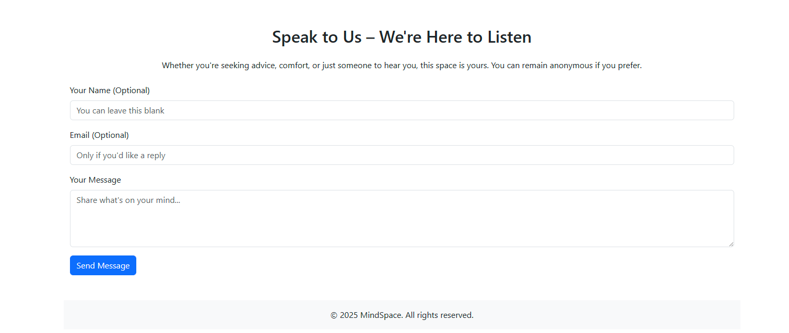
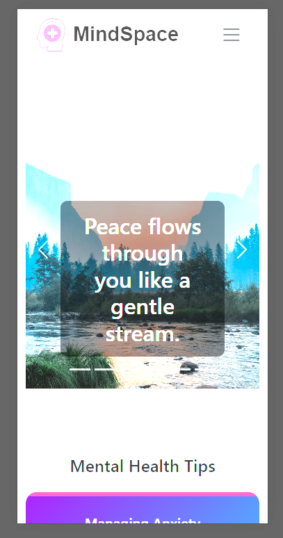
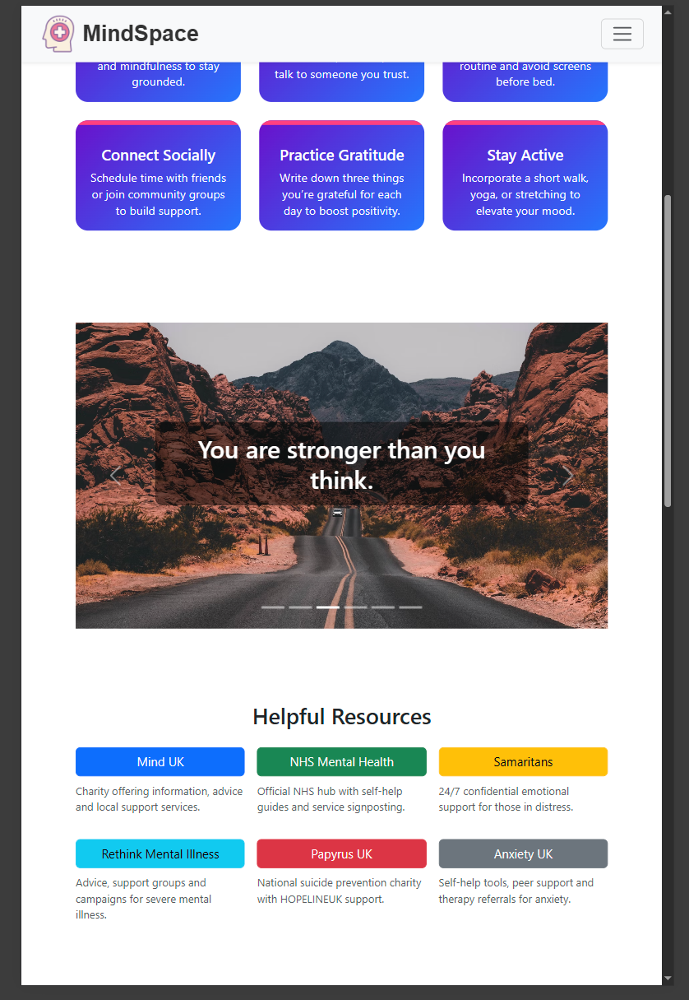
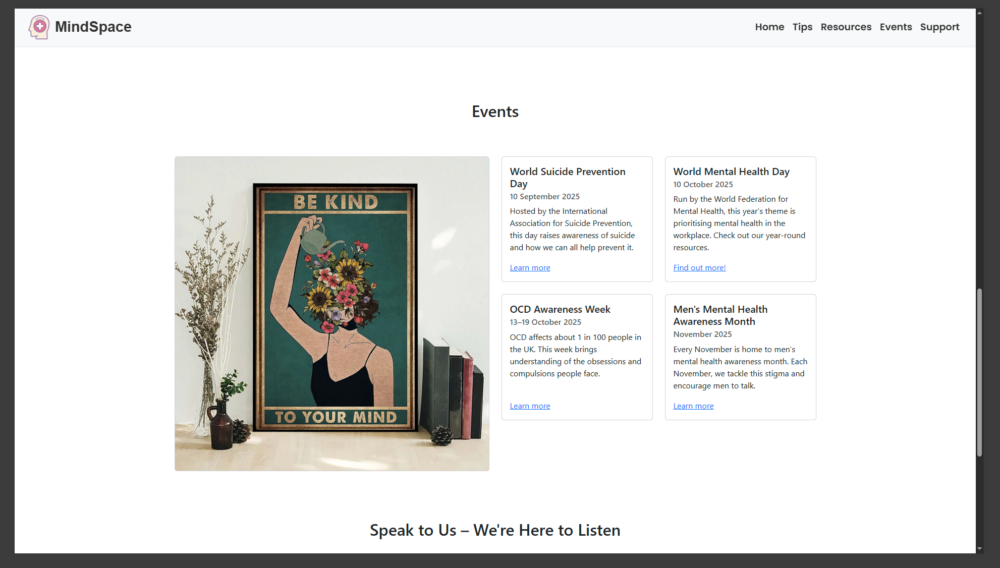

# 🌿 MindSpace – Mental Health Awareness Webpage

## 🧠 Project Overview

MindSpace is a one-page responsive website designed to promote mental health awareness. Built with HTML5, CSS3, Bootstrap 5, and JavaScript, the site offers calming visuals, practical tips, affirmations, and trusted resources—all in a single, accessible layout. Developed as part of the AI-Augmented FullStack Bootcamp, this project showcases front-end design, responsiveness, accessibility, validation, deployment, documentation, and maintainability.

## 💡 User Value

MindSpace delivers beginner-friendly mental health guidance in an inviting, supportive format. Users can:

- View a rotating carousel of affirmations paired with serene imagery
- Explore a grid of six actionable mental health tips (anxiety, stress, sleep, social connection)
- Access a curated list of trusted mental health organisations
- Learn about key mental health awareness dates in the events section
- Submit thoughts anonymously via a simple support form

## 🛠️ Technologies Used

- HTML5
- CSS3
- Bootstrap 5
- Google Fonts (Montserrat, Poppins)
- JavaScript for form interactivity

## 🚀 Deployment

The site is hosted on a cloud platform for reliable, global access.

**Live site:** [https://khizermalik1.github.io/-mental-health-awareness-project-mindspace]

## 🖼️ Screenshots and Feature Overview

**Affirmations Carousel**  
A rotating set of soothing images with supportive messages.  

**Mental Health Tips Section**  
Six Bootstrap cards offering practical advice for stress, anxiety, sleep, and connection.  

**Resources Section**  
Buttons linking to verified mental health organisations, each with a short descriptor.  

**Events Section**  
Highlights key mental health awareness dates with structured cards.  

**Support Form**  
Anonymous message form with a thank-you confirmation on submission.  

### 🔄 Responsive Design Overview

#### Mobile View (320px)

Viewport: 320px. Single-column layout, stacked content, hamburger menu, full-height carousel image.  

#### Tablet View (768px)

Viewport: 768px. Two-column grid for tips, expanded nav, medium-sized carousel, side-by-side resources.  

#### Laptop View (1024px)

Viewport: 1024px. Three-column grid for tips and events, full navbar with inline links, wide-format images.  

## ✅ Validation & Accessibility

- HTML and CSS validated via W3C and Jigsaw
- Semantic HTML elements throughout
- Alt text for every image
- WCAG-compliant color contrast
- Fully responsive across devices
- Intuitive, keyboard-friendly navigation

## 📚 Documentation & Maintainability

- Clean, well-commented, modular code
- Comprehensive README covering purpose, setup, screenshots, and credits
- External libraries and code snippets properly attributed
- Version control with clear, descriptive commits
- No leftover commented-out code

## 🏷️ Attribution

- Images sourced under free-use license from [Unsplash](https://unsplash.com)
- External links to verified mental health organisations
- No unlicensed or copyrighted code
